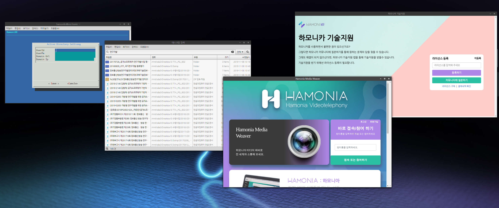

# Office tool-chains for HamoniKR

## Office tool-chain with sub-projects (HamoniKR 3.0)

사용자들이 클라우드 및 스마트워크 환경에서 조직이 보유한 분산된 지식에 대한 원문검색 기능(MS 오피스, 아래한글, PDF 등)과 문서 소유자와 실시간 문서공유 및 영상회의를 할 수 있는 공유 기능을 통해 개인과 그룹 간의 가치 있는 정보 교환을 촉진하는 오피스 툴체인 소프트웨어 프로젝트

## sub-modules
* hamonikr-ldapconn : AD Connector (계정 디렉토리 설정도구)
* hamonikr-finder : HamoniKR Finder (클라우드 문서 원문검색)
* hamonikr-apphamonia : Hamonia (실시간 문서 공유 및 영상 회의)
* hamonikr-support : Issue Collector (기술지원 도구)

## License
* GPL v3

## Contributors
* @bigeden
* @bsairline
* @chaeya
* @gon1942
* @LukeHan1128

# Issue & Communication

https://hamonikr.org
